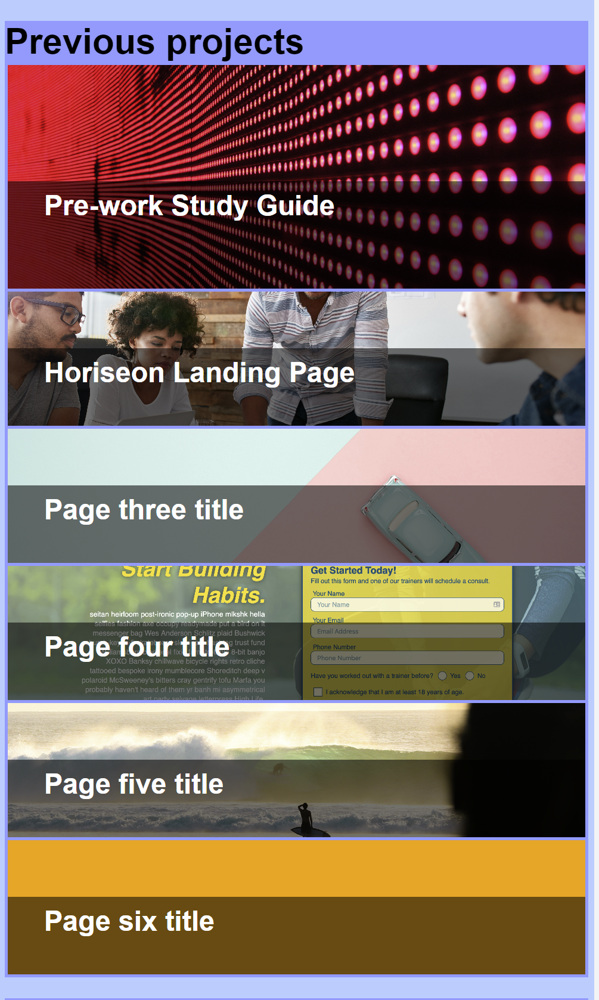
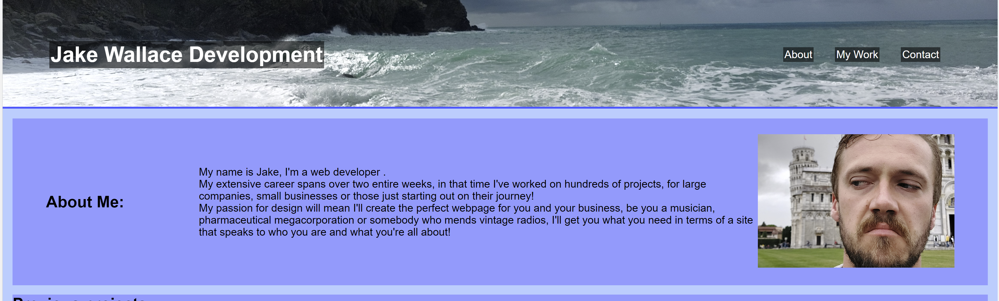

# Week_2_Challenge
##Link to live page: https://jake-w95.github.io/Wallace-J-Portfolio-2022/
## A portfolio of work to be used as evidence of my capabilities for potential employers

- This project was an opportunity to practice and showcase all that I've learned so far during the course
- The introduction of new concepts as well as more farmiliar ones raised certain issues that I had to research and fix myself, proving to be an excellent learning exercise
- Learning how best to optimise a page for different screen sizes proved difficult, I ran into numerous problems that didn't make sense for some time but through a mix of research and trial-and-error those issues were resolved
- Learning about and implementing 'Pseudo-classes' showed me how relatively simple it can be to create more interesting and dynamic pages.

One of the most important considerations when writing this page was to ensure that it was capable of being viewd on different device screens, meaning media queries had to be used.
I found that for most aspects this was fairly straightforward, for example when re-structuring <b>grid</b> elements, as seen below:

<b>The image above shows the grid on a large screen.</b>
As you can see, I wrote css so that when a user hovers over one of the items in the grid, the title moves from the bottom of the image to the top, revealing a short description of the project; This was surprisingly tricky for me to figure out, the entire layout would become compromised and I struggled to get the effect I was after for a while, eventually through implementing <b>grid</b> and <b>display: none</b> properly I achieved that goal.

<b>The image below shows the grid when viewed on a small screen (<400 pixels) </b>

Given the fact that, when viewed on a smakker screen, the page effectively takes up more room, it was important to have navigation to each section;

The above image shows the navigation nested within the header at full-screen

The image below shows the navigation on the smaller screen

